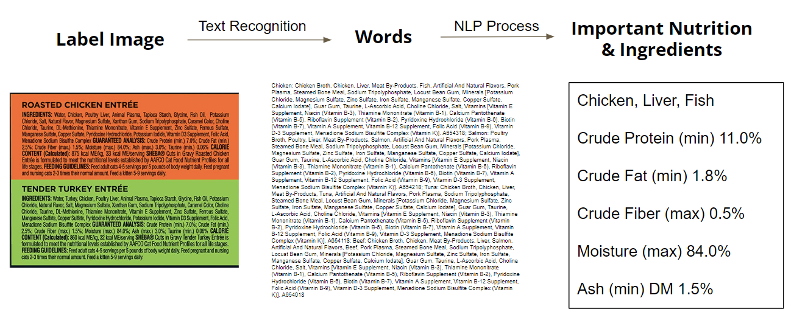

# Text Recognition From Canned Cat/Dog Food

Sparked by our daily life, many people are pets lovers. As a responsible pet owner, when picking the canned food for pets, we care about the nutrition/ingredients. However, the thing is that the can is very small, and the ingredients list on the can is tiny. It’s hard and time consuming for us to recognize the important main ingredients or the artificially added materials, especially for those allergic pet owners.

The project aims to generate the keyword summary from the given photo of the pet food label. We first use text recognition algorithms to grab words from images. Then use NLP and string patterns to obtain the label summary.


# Data
As there are no prepared data set for pet food label images, we grabbed the data from online web pages. The product intro page has existing ingredient lists, we manually utilized those images as our feed data. We collected 77 images of the canned pet food labels in total, stored at [/data](https://github.com/mgeg/text-recognition-canned-petfood/tree/main/data). 

# Pipeline
Here is the sample pipeline of our works. We are going to use image cat33 as an [example](https://github.com/mgeg/text-recognition-canned-petfood/blob/main/code/pipeline.ipynb). 

<table><tr><td>

</td></tr></table>

### Step 1. Text Recognition
We ues the pytesseract as our OCR model to transfrom images to words.
<table><tr><td>


</td></tr></table>

```python
from PIL import Image
import pytesseract

pytesseract.pytesseract.tesseract_cmd = '/usr/local/bin/tesseract'
content = pytesseract.image_to_string(Image.open("petfood/cat33.jpg"))
```

### Step 2. Keyword Extraction
We use KeyBERT and Yake pretrain model to grab the top 5 keywords from labels. The keywords usually indicate the main ingredients.
```python
from keybert import KeyBERT

kw_model = KeyBERT()
kw_model.extract_keywords(content, keyphrase_ngram_range=(1, 4),  use_mmr=True, diversity=0.7, top_n=5)
```
```bash
('ingredients beef turkey', 0.5894),
('vitamin b9 guaranteed analysis', 0.3423),
('feeding guidelines feed lbs', 0.2506),
('blue wilderness rocky', 0.1337),
('potassium chloride', 0.2458)
```
```python
import yake

kw_extractor = yake.KeywordExtractor(dedupLim= 0.5,top= 5)
kw_extractor.extract_keywords(content)
```
```bash
('Beef Broth', 0.0038952617792384105),
('Turkey Liver', 0.0038952617792384105),
('Amino Acid Chelate', 0.004572391876902759),
('Iron Amino Acid', 0.01781315316406169),
('Vitamin', 0.019824890834276434)
```

### Step 3. String Pattern Matching
After we analyzed the indegredent content, we believe the **guaranteed analysis** also contains importanct nutrition that pet lovers pay attention to. As there are some special characters such as `%` and `()` that are unable to extract using existing keyword extraction models. Therefore, we identify the particular string patterns to obtain the guaranteed analysis of nutrition content. Below picture shows the output after using stirng pattern matching.
<table><tr><td>

</td></tr></table>

# Evaluation

We used Pie Chart to compare the `KeyBERT` and `Yake` model based on the accuracy. First, we manually label whether it's useful information or not. The chart below shows the overall performance of the 2 models. In general, compared with `Yake` model, `KeyBERT` model performances is better, with 78% of useful information.


# Conclusion
In conclusion, our model in general perform well if our feed data is clear. In the further, we can still improve the model by considering improve the OCR results. The Tesseract sometimes failed to grab the words if the feed data is blurred. We calculated the OCR results accuracy with around 90%, therefore, we should consider to try new OCR model or train our own model to improve the accuracy.
On the other hand, the `KeyBERT` model also have the room to improve. For some feed data, it failed to extract all of info in one picture. For example, one model is suppsed to extract beef, turkey and liver as the key ingredient, while the ouput only contains beef and turkey. In the future, we may consider use more customized word extraction model to be train.

